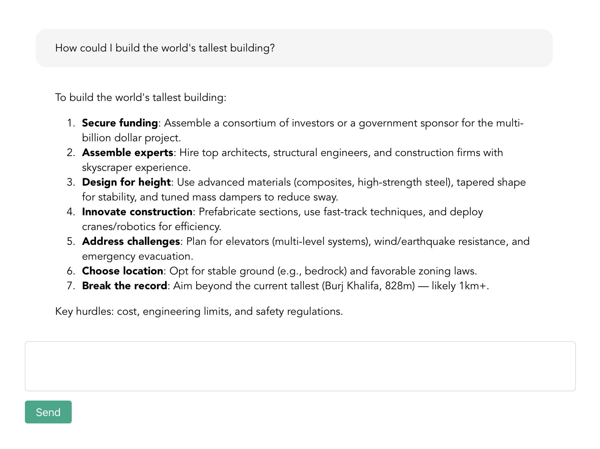

# Minimal chat

A very simple chat interface for interacting with LLMs. I mostly just made this to test my Apple Intelligence API.

<p align="center">

</p>

## Features
- [X] Basic chat interface
- [X] Streaming responses
- [X] Markdown support

Improvements that could be made:
- [ ] Any number of visual improvements...
- [ ] Store chat history with local storage (a database is probably overkill for this...)
- [ ] Port to Nuxt (and move OpenRouter calls to backend)

For my purposes, this project is complete. But if you're looking to get your hands dirty with Vue or Nuxt, I would welcome any PRs!

## Project setup
```
bun install
```

### OpenRouter API key
If you want to use this, you need to create a file `./src/keys.js` with the line
```
export const API_KEY = < your OpenRouter API key >
```
Note that this is terrible for anything except simple testing. Your API key **will** be exposed to the front end!

### Run development server
```
bun run dev
```

### Build for production
```
bun run build
```

### Locally preview production build
```
bun run preview
```
